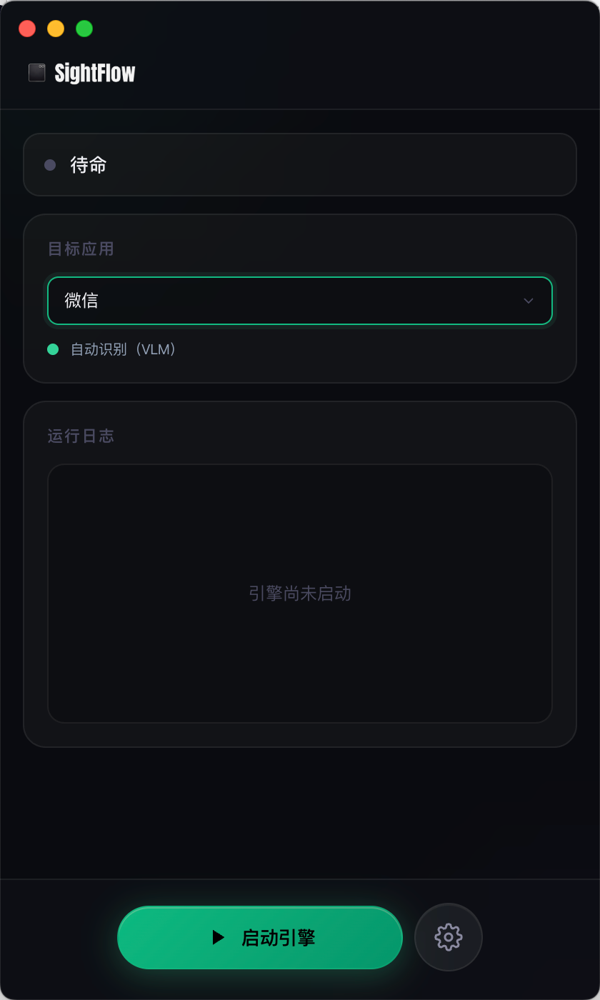
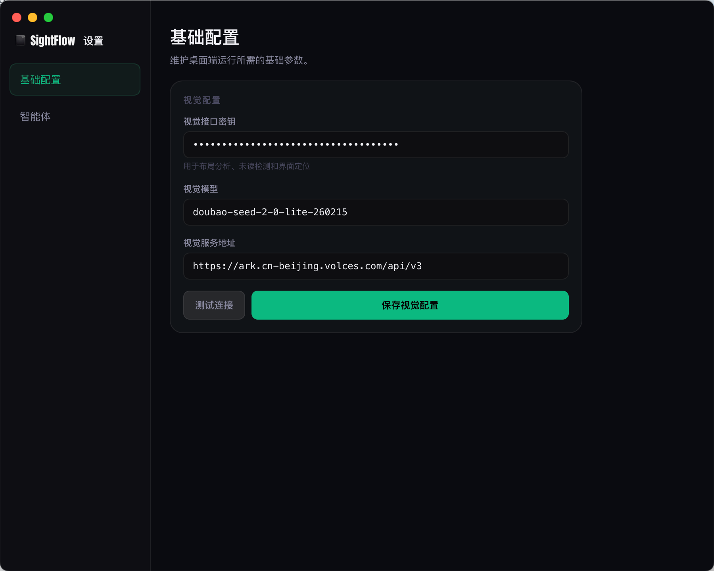
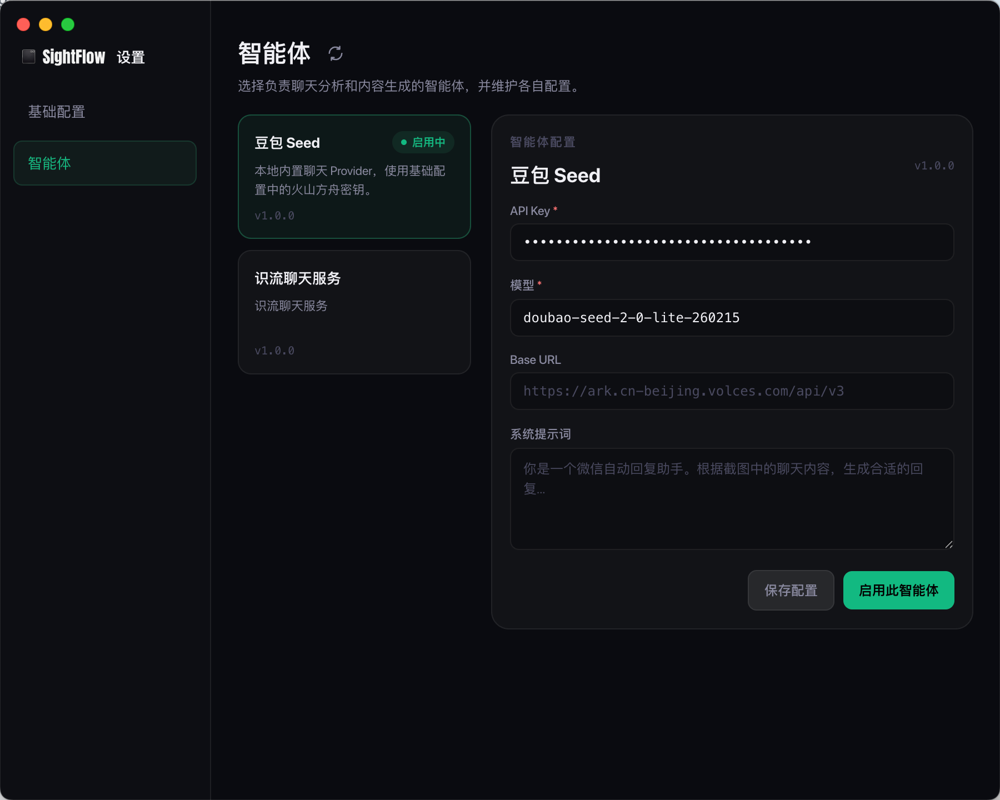

# SightFlow Mimo

> Fork from [sightflow-dev/sightflow-desktop-agent](https://github.com/sightflow-dev/sightflow-desktop-agent)
> 本分支添加了小米 Mimo 模型支持和自定义视觉模型配置

---

# SightFlow.dev (原版)


Official website： [https://sightflow.dev](https://sightflow.dev/)


# 招募共建开发者
我们相信Agent Computer Use 会是未来10年重要AI革命的基建，如果你也希望参与到这个项目迭代，欢迎联系\

[加入Discord](https://discord.com/invite/8H6KpbXq3t)

## ✨ 本分支改动

- 支持自定义视觉模型名称（不再硬编码 doubao）
- 支持自定义 Base URL（兼容小米 Mimo 等其他服务商）
- 新增小米 Mimo Provider 插件
- 优化会话检测间隔

## 🔑 AI 模型与智能体配置（原版文档）

本项目依赖大语言模型/视觉模型（Vision Language Model）驱动 RPA。
桌面端的配置分为两层：

- **基础配置**：填写火山方舟 API Key，用于视觉定位、内置豆包智能体等基础能力。
- **智能体**：选择负责聊天分析和内容生成的 Provider，并维护各自配置。

### SK Key 的用途
1. **智能对话回复**：由于项目涉及类似微信等的自动抓取，模型会分析聊天界面的截图并生成自然的回复内容（带防止自我循环对话机制）。
2. **VLM 视觉定位引导**：基于屏幕截图和特定 Prompt，让模型自动检测屏幕上的 UI 控件，并返回需要点击的坐标，从而驱动纯视觉的 RPA 流程。

### 如何配置
1. 请前往 [火山引擎控制台 - 方舟原生接口](https://console.volcengine.com/ark) 开通相关服务，并生成/获取你的 API Key。
2. 启动项目后点击主界面右下角的设置按钮，打开独立设置窗口。
3. 在**基础配置**中填写 API Key。默认 Base URL 为 `https://ark.cn-beijing.volces.com/api/v3`，通常无需修改。
4. 在**智能体**中选择当前使用的 Provider。内置默认智能体为**豆包 Seed**，模型固定为 `doubao-seed-2-0-lite-260428`。

### 界面预览

| 主界面 | 基础配置 | 智能体配置 |
| --- | --- | --- |
|  |  |  |

## 目标应用与框选模式

主界面提供**目标应用**快捷配置，用来决定桌面端如何测量聊天窗口布局：

- 微信、企业微信默认使用 VLM 自动识别窗口区域。
- 钉钉、飞书、Slack、Telegram、其他桌面应用默认使用手动框选。
- 当目标应用需要框选时，点击**开始框选**，依次圈出会话列表、聊天内容区、输入框 3 个区域。
- 框选结果会按目标应用保存到本地；后续启动会复用已保存区域，也可以随时重新框选。

VLM 和框选模式只影响“如何测量布局”。运行时截图、内容分析、生成回复和发送消息会消费同一套布局结果。

## 智能体 / Provider Hub

SightFlow 桌面端把“截图分析并生成回复”的聊天能力抽象为独立 Provider。Provider 通过 `manifest.json` 声明配置结构，通过 bundle 入口接收聊天截图并返回 `reply_text`、`skip`、`error` 等事件。

当前应用内置一个简单的 Provider Hub：

- 默认从 `https://sightflow.dev/provider-hub.json` 拉取候选 Provider 列表。
- Hub 只维护 Provider 的 `manifestUrl`，UI 展示字段来自各 Provider 的 manifest。
- 首次加载后会缓存到本地；除非手动点击智能体标题旁的刷新按钮，否则优先使用本地缓存。
- 本地始终保留内置**豆包 Seed**作为默认 Provider，避免远端列表不可用时没有可选项。

外部 Provider 接入说明见：[聊天 Provider 接入文档](./docs/provider.md)。

当前仓库仍保留一个 Doubao / 火山方舟 Provider 示例，供接入文档和本地开发参考：

```text
resources/providers/volcengine-ark/manifest.json
resources/providers/volcengine-ark/provider.bundle.js
```

## 🚀 快速开始 (Project Setup)

### 1. 安装依赖

```bash
npm install
```

### 2. 本地开发运行

```bash
npm run dev
```
> **提示**：启动后，应用将打开主界面。请先选择目标应用并完成必要的框选，再进入设置窗口填写 API Key、确认当前启用的 Provider。

## 📦 打包构建 (Build)

```bash
# 构建 Windows 版本
npm run build:win

# 构建 macOS 版本
npm run build:mac

```

## 📬 联系方式

想联系作者？在 GitHub 页面按 F12 打开控制台：

1. 先在控制台输入 `allow pasting` 回车（解除粘贴限制）
2. 然后粘贴执行以下代码：

```javascript
console.log('微信: ' + atob('OTc5NDQ3MDI5'))
```

## 🔗 相关项目

- [wechat-bot-scripts](https://github.com/xove1017-ship-it/wechat-bot-scripts) - 微信自动化脚本工具集，支持自动回复、消息发送
- [sightflow-desktop-agent (原版)](https://github.com/sightflow-dev/sightflow-desktop-agent) - SightFlow 官方仓库

## 开发环境推荐配置

- [VSCode](https://code.visualstudio.com/) + [ESLint](https://marketplace.visualstudio.com/items?itemName=dbaeumer.vscode-eslint) + [Prettier](https://marketplace.visualstudio.com/items?itemName=esbenp.prettier-vscode)
